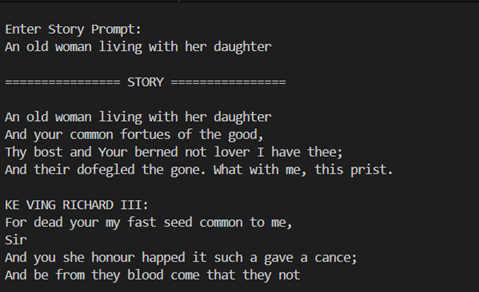

# --> Storyteller-Shakespeare

A small GPT-style **character-level Transformer language model** trained
on Shakespearean text.

This project implements a decoder-only Transformer from scratch using
PyTorch. The model is trained on a Shakespeare text dataset and can
generate Shakespeare-style text from a user-provided prompt.

The model was trained using **CUDA on an NVIDIA RTX 3050 Laptop GPU**.

---

## --> Project Overview

The goal of this project is to understand and implement the core
components behind a GPT-style language model rather than simply using a
pre-trained API.

The project covers:

* Character-level tokenization\\
* Transformer-based language modeling
* Self-attention and multi-head attention
* Positional embeddings
* Decoder-only Transformer blocks
* Causal masking for autoregressive generation
* Cross-entropy language-model training
* CUDA/GPU acceleration with PyTorch
* Text generation from user prompts
* Train/validation loss evaluation

The current model is intentionally small so that it can be trained
locally on a consumer laptop GPU.

---

## --> Model Architecture

The model follows a simplified GPT-style decoder-only Transformer
architecture.

``` text
Input Text
    |
    v
Character Tokenization
    |
    v
Token Embedding + Position Embedding
    |
    v
+-----------------------------+
| Transformer Block           |
|                             |
| Multi-Head Self-Attention   |
|            |                |
|      Residual Connection    |
|            |                |
| Layer Normalization         |
|            |                |
| Feed Forward Network        |
|            |                |
|      Residual Connection    |
|            |                |
| Layer Normalization         |
+-----------------------------+
    |
    v
Repeated Transformer Blocks
    |
    v
Linear Language Model Head
    |
    v
Next-Character Probabilities
    |
    v
Autoregressive Text Generation
```

The model predicts the next character based on the previous characters
in the context window.

---

## --> Model Configuration

Parameter                                    Value

---

Architecture              Decoder-only Transformer
Vocabulary Size                      65 characters
Embedding Dimension                            128
Transformer Layers                               4
Attention Heads                                  4
Context Length                                  64
Dropout                                        0.2
Batch Size                                      32
Learning Rate                               0.0003
Optimizer                                    AdamW
Loss Function                        Cross-Entropy
Training Iterations                          5,000
Parameters                                 816,705
Training Device         NVIDIA RTX 3050 Laptop GPU
Framework                                  PyTorch

---

## --> Dataset

The model uses a Shakespeare text corpus stored at:

``` text
data/input.txt
```

Dataset statistics used during development:

* Size: approximately **1.06 MB**
* Characters: approximately **1.1 million**
* Vocabulary: **65 unique characters**

The project uses character-level modeling, meaning the model works
directly with individual characters rather than words or subword tokens.

---

## --> Training Pipeline

``` text
Shakespeare Dataset
        |
        v
Build Character Vocabulary
        |
        v
Encode Characters as Integer IDs
        |
        v
Create Training / Validation Splits
        |
        v
Create Random Context Batches
        |
        v
Transformer Forward Pass
        |
        v
Calculate Cross-Entropy Loss
        |
        v
Backpropagation
        |
        v
AdamW Optimization
        |
        v
Repeat for 5,000 Iterations
        |
        v
Save model.pth
```

The training script automatically uses CUDA when it is available.

---

## --> Training Results

A fresh 5,000-iteration training run was completed using the NVIDIA RTX
3050 Laptop GPU.

Metric                               Value

---

Training Time                \~275 seconds
Training Time       \~4 minutes 35 seconds
Training Loss                       1.6156
Validation Loss                     1.7824

An earlier checkpoint used during development recorded:

Metric               Value

---

Training Loss       1.6092
Validation Loss     1.7700

Loss values can vary between runs because of random initialization,
batch sampling, and training conditions.

---

## --> Text Generation

After training, the saved model can generate text from a starting
prompt.

Example prompts tested during development:

``` text
Once upon a time
The king entered the castle
ROMEO:
HAMLET:
In the dark forest
```

The model produces Shakespeare-like vocabulary and dialogue formatting,
although the current small character-level model can still generate
malformed words, inconsistent grammar, and less coherent passages.

This is an expected limitation of the current model size and training
setup.

---

## --> Evaluation

The repository includes:

``` text
evaluate.py
```

This script loads the trained checkpoint and evaluates the model using
the training and validation datasets.

Run:

``` bash
python evaluate.py
```

It automatically uses CUDA when a compatible GPU is available and
otherwise falls back to CPU.

---

## --> Project Structure

``` text
Storyteller-Shakespeare/
|
+-- data/
|   +-- input.txt
|
+-- model/
|   +-- gpt.py
|
+-- .gitignore
+-- README.md
+-- Screenshot.png
+-- evaluate.py
+-- generate.py
+-- model.pth
+-- requirements.txt
+-- train.py
```

File                 Purpose

---

`train.py`           Trains the Transformer model
`generate.py`        Generates text from the trained model
`evaluate.py`        Evaluates training and validation loss
`model/gpt.py`       Defines the GPT-style Transformer architecture
`data/input.txt`     Shakespeare training corpus
`model.pth`          Trained model checkpoint
`requirements.txt`   Python dependencies
`Screenshot.png`     Project/output screenshot
`.gitignore`         Prevents unnecessary local files from being committed

---

## --> Getting Started

### --> 1. Clone the repository

``` bash
git clone https://github.com/Suman-Aryann/Storyteller-Shakespeare-.git
cd Storyteller-Shakespeare-
```

### --> 2. Create a virtual environment

Windows:

``` bash
python -m venv venv
venv\\\\Scripts\\\\activate
```

Linux/macOS:

``` bash
python3 -m venv venv
source venv/bin/activate
```

### --> 3. Install dependencies

``` bash
pip install -r requirements.txt
```

---

## --> Check CUDA

Verify CUDA availability:

``` bash
python -c "import torch; print(torch.cuda.is\\\_available()); print(torch.cuda.get\\\_device\\\_name(0) if torch.cuda.is\\\_available() else 'CPU')"
```

Expected output on a compatible setup is similar to:

``` text
True
NVIDIA GeForce RTX 3050 Laptop GPU
```

The project was trained successfully on an RTX 3050 Laptop GPU using
CUDA.

---

## --> Generate Text

Run:

``` bash
python generate.py
```

The generation script loads `model.pth` and generates text using the
trained Transformer.

---

## --> Train the Model

To train the model from scratch:

``` bash
python train.py
```

Current configuration:

* 5,000 iterations
* Batch size 32
* Context length 64
* Learning rate 0.0003
* AdamW optimizer
* CUDA when available

Training time depends on the available hardware.

---

## --> Evaluate the Model

Run:

``` bash
python evaluate.py
```

The script reports the model's loss on the training and validation
datasets.

---

## --> Hardware Used

Component     Specification

---

CPU           AMD Ryzen 5 5600H
GPU           NVIDIA RTX 3050 Laptop GPU
RAM           16 GB
Framework     PyTorch
Accelerator   CUDA

The model is compact enough to be trained on a consumer laptop GPU.

---

## --> Technologies Used

* Python
* PyTorch
* CUDA
* Transformer Architecture
* Multi-Head Self-Attention
* Deep Learning
* Character-Level Language Modeling
* Git
* GitHub

---

## --> What I Learned

This project was built to understand the internal workflow of a
GPT-style language model.

Key concepts implemented and explored:

1. Character-level tokenization
2. Vocabulary creation
3. Training/validation dataset splitting
4. Context-window sampling
5. Token and positional embeddings
6. Self-attention
7. Multi-head attention
8. Causal masking
9. Feed-forward neural networks
10. Residual connections
11. Layer normalization
12. Transformer blocks
13. Autoregressive language modeling
14. Cross-entropy loss
15. AdamW optimization
16. GPU-accelerated training
17. Model checkpointing
18. Text generation
19. Validation loss evaluation

---

## --> Limitations

The current model is a small educational implementation rather than a
production-scale language model.

Current limitations include:

* Small model size
* Character-level tokenization
* Short context window
* Limited training iterations
* Small training corpus
* Occasional malformed words
* Inconsistent grammar
* Limited long-range context
* No instruction tuning
* No modern subword tokenizer
* No large-scale pretraining

Because of these constraints, the generated text should be viewed as an
experimental demonstration of Transformer-based language modeling.

---

## --> Future Improvements

Possible improvements include:

### --> Model Improvements

* Increase embedding dimension
* Increase the number of Transformer layers
* Increase the number of attention heads
* Increase context length
* Train for more iterations
* Tune learning rate and dropout
* Use learning-rate scheduling

### --> Tokenization Improvements

* Implement BPE tokenization
* Experiment with subword tokenization
* Compare character-level and token-level generation

### --> Dataset Improvements

* Use a larger and cleaner corpus
* Increase dataset diversity
* Experiment with additional literary datasets

### --> Generation Improvements

* Add temperature control
* Add top-k sampling
* Add top-p / nucleus sampling
* Add configurable maximum generation length
* Add an interactive web interface

### --> Engineering Improvements

* Add experiment tracking
* Add training-loss visualization
* Add automated evaluation
* Add model configuration files
* Add Docker support
* Deploy an inference API

---

## --> Why a Small GPT Model?

Large language models require substantial computational resources for
training.

This project focuses instead on understanding the fundamental components
that make GPT-style models work.

A small model makes it possible to:

* Inspect the architecture
* Modify the implementation
* Train locally
* Experiment with hyperparameters
* Observe training behavior
* Understand autoregressive generation

The project therefore serves as a practical implementation of the
concepts behind decoder-only Transformer language models.

---

## --> Reproducibility

The repository contains the trained checkpoint:

``` text
model.pth
```

This allows the generation script to be run without retraining the
model.

For a fresh experiment:

``` bash
python train.py
python evaluate.py
python generate.py
```

---

## --> Project Screenshot

!\[Project Screenshot](Screenshot.png)

---

## --> Learning Objective

The primary objective of this project was to move beyond using pre-built
language-model APIs and understand the underlying mechanics of a
GPT-style architecture through implementation.

The complete workflow is:

``` text
Dataset
   |
   v
Tokenization
   |
   v
Training Batches
   |
   v
Transformer
   |
   v
Loss Calculation
   |
   v
Backpropagation
   |
   v
GPU Training
   |
   v
Checkpoint
   |
   v
Evaluation
   |
   v
Text Generation
```

---

## --> Author

**Suman Aryann**

B.Tech --- Artificial Intelligence \& Machine Learning

GitHub: https://github.com/Suman-Aryann

---

## --> Project Summary

**Storyteller-Shakespeare** is a compact GPT-style character-level
language model implemented in PyTorch and trained on Shakespearean text.

The project demonstrates how a decoder-only Transformer can learn
character-level language patterns and generate new Shakespeare-style
text from a prompt.

The model contains **816,705 parameters** and was trained for **5,000
iterations on an NVIDIA RTX 3050 Laptop GPU using CUDA**.

The project is primarily focused on learning, experimentation, and
demonstrating the fundamentals of Transformer-based language modeling.

 with hyperparameters
-   Observe training behavior
-   Understand autoregressive generation

The project therefore serves as a practical implementation of the
concepts behind decoder-only Transformer language models.

------------------------------------------------------------------------

## --\> Reproducibility

The repository contains the trained checkpoint:

``` text
model.pth
```

This allows the generation script to be run without retraining the
model.

For a fresh experiment:

``` bash
python train.py
python evaluate.py
python generate.py
```

------------------------------------------------------------------------

## --\> Project Screenshot



------------------------------------------------------------------------

## --\> Learning Objective

The primary objective of this project was to move beyond using pre-built
language-model APIs and understand the underlying mechanics of a
GPT-style architecture through implementation.

The complete workflow is:

``` text
Dataset
   |
   v
Tokenization
   |
   v
Training Batches
   |
   v
Transformer
   |
   v
Loss Calculation
   |
   v
Backpropagation
   |
   v
GPU Training
   |
   v
Checkpoint
   |
   v
Evaluation
   |
   v
Text Generation
```

------------------------------------------------------------------------

## --\> Author

**Suman Aryann**

B.Tech --- Artificial Intelligence & Machine Learning

GitHub: https://github.com/Suman-Aryann

------------------------------------------------------------------------

## --\> Project Summary

**Storyteller-Shakespeare** is a compact GPT-style character-level
language model implemented in PyTorch and trained on Shakespearean text.

The project demonstrates how a decoder-only Transformer can learn
character-level language patterns and generate new Shakespeare-style
text from a prompt.

The model contains **816,705 parameters** and was trained for **5,000
iterations on an NVIDIA RTX 3050 Laptop GPU using CUDA**.

The project is primarily focused on learning, experimentation, and
demonstrating the fundamentals of Transformer-based language modeling.
